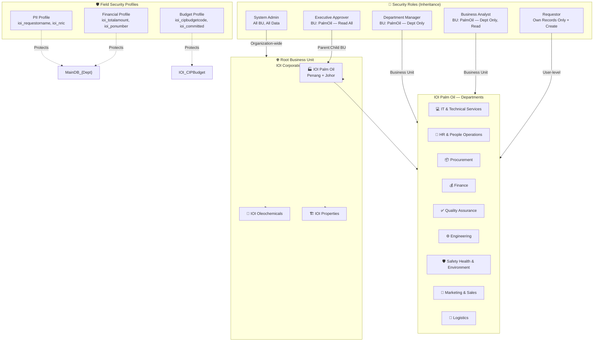
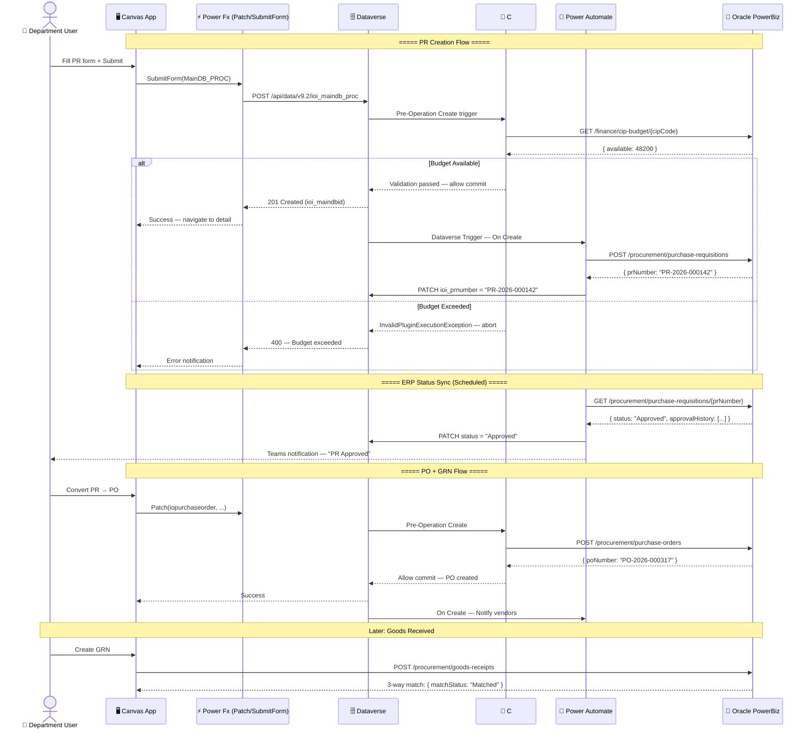
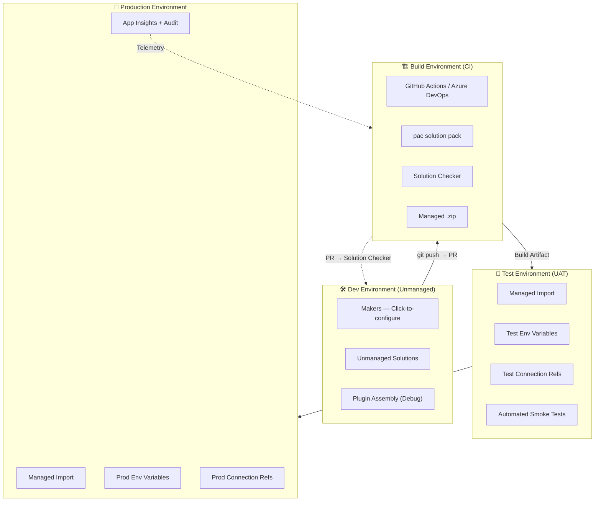

# Dataverse Target Architecture — Entity-Relationship Diagram

> **Phase 2 Blueprint** — Enterprise-grade production data layer replacing SharePoint Online staging.
> Rendered via [Mermaid](https://mermaid.js.org). Copy the diagram blocks into any Mermaid-compatible viewer,
> or render directly in GitHub Markdown / VS Code with the Mermaid extension.

---

## 1. Core Data Model — MainDB with Polymorphic Child Tables

```mermaid
erDiagram
    %% ── Business Unit Hierarchy ──
    BUSINESSUNIT {
        guid businessunitid PK
        string name "e.g. IOI PalmnOil, IOI Oleo, IOI Property"
        guid parentbusinessunitid FK "Self-referencing hierarchy"
        bool isdisabled
    }

    %% ── MainDB Parent Table (one per department) ──
    MAINDB_DEPT {
        guid ioi_maindbid PK
        guid owningbusinessunit FK "Departmental data isolation"
        string ioi_formcode "Discriminator: ITSSR, EAF, SAPCR, PRF..."
        string ioi_title
        int ioi_status "Draft→Submitted→Approved→Rejected→Completed"
        guid ioi_requestor FK "systemuser"
        guid ioi_owninguser FK "systemuser"
        datetime ioi_submittedon
        datetime createdon
        guid createdby FK
        datetime modifiedon
        guid modifiedby FK
    }

    %% ── Task (polymorphic child via Regarding lookup) ──
    TASK {
        guid activityid PK
        guid regardingobjectid "Polymorphic → MainDB_{Dept}"
        string regardingobjectidtype "Table discriminator"
        string subject
        string description
        guid ownerid FK "systemuser"
        datetime scheduledend
        int prioritycode "0=Low 1=Normal 2=High"
        int statecode "0=Open 1=Completed 2=Canceled"
    }

    %% ── Comment/Note (polymorphic via Regarding) ──
    ANNOTATION {
        guid annotationid PK
        guid objectid "Polymorphic → MainDB_{Dept}"
        string objectidtypecode "Table discriminator"
        string subject
        string notetext "Rich text body"
        bool isdocument "true if file attachment"
        string filename
        string mimetype
        guid owninguser FK
    }

    %% ── Approval Matrix (5-tier) ──
    IOI_APPROVALMATRIX {
        guid ioi_approvalmatrixid PK
        guid ioi_maindbid FK "Parent record — N:1"
        int ioi_tier "1=Requestor 2=LineMgr 3=Finance 4=Compliance 5=Executive"
        guid ioi_approver FK "systemuser"
        int ioi_status "0=Pending 1=Approved 2=Rejected 3=Escalated"
        datetime ioi_decidedon
        string ioi_comments
    }

    %% ── CIP Budget (ERP-aligned alternate key) ──
    IOI_CIPBUDGET {
        guid ioi_cipbudgetid PK
        string ioi_cipbudgetcode AK "Alternate Key — Oracle ERP sync"
        string ioi_budgetname
        money ioi_totalbudget "Currency: MYR"
        money ioi_committed
        money ioi_actuals
        int ioi_fiscalyear
        string ioi_costcenter
        guid owningbusinessunit FK "BusinessUnit"
    }

    %% ── Relationship Section ──
    MAINDB_DEPT ||--o{ TASK : "Regarding (polymorphic)"
    MAINDB_DEPT ||--o{ ANNOTATION : "Regarding (polymorphic)"
    MAINDB_DEPT ||--o{ IOI_APPROVALMATRIX : "Parent Record"
    BUSINESSUNIT ||--o{ MAINDB_DEPT : "owningbusinessunit"
    BUSINESSUNIT ||--o{ IOI_CIPBUDGET : "owningbusinessunit"
```

---

## 2. Security Model — Business Unit Hierarchy & Role Inheritance



---

## 3. End-to-End Data Flow — Canvas App → Dataverse → Oracle ERP



---

## 4. Solution Segmentation — ALM Component Boundaries

```mermaid
graph LR
    subgraph DEV["🔧 Dev — Unmanaged"]
        DIR1["ioi_CoreEntities<br/>Tables + Columns + Keys"]
        DIR2["ioi_BusinessLogic<br/>Plugins + Workflows + BPF"]
        DIR3["ioi_UIComponents<br/>Canvas Apps + PCF + MDA"]
        DIR4["ioi_Shared<br/>ConnectionRefs + EnvVars + ChoiceLists"]
    end

    subgraph BUILD["📦 Build — Export + Segment"]
        HOLDING["ioi_Holding<br/>Unmanaged → All-in-One"]
    end

    subgraph SEGMENT["🧩 Solution Segmentation"]
        MGD_CORE["ioi_CoreEntities<br/>Managed"]
        MGD_LOGIC["ioi_BusinessLogic<br/>Managed"]
        MGD_UI["ioi_UIComponents<br/>Managed"]
    end

    subgraph DEPLOY["🚀 Environment Promotion"]
        TEST["Test Env<br/>Managed Import<br/>+ Test Settings"]
        PROD["Prod Env<br/>Managed Import<br/>+ Prod Settings"]
    end

    DEV --> BUILD
    BUILD --> HOLDING
    HOLDING -->|"pac solution pack"| SEGMENT
    SEGMENT -->|"pac solution import"| TEST
    TEST -->|"Promote"| PROD

    TEST -.->|"Solution Checker<br/>Quality Gate"| SEGMENT
    PROD -.->|"Smoke Test<br/>Post-Deploy"| PROD
```



---

## 5. Environment Strategy — Dev → Build → Test → Prod



---

*Generated as part of the Dataverse Migration Blueprint — Phase 2 target architecture.*
